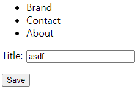
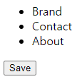

# Function Based View to Class Based View

```cmd
trydjango>python manage.py startapp courses
trydjango>dir courses
<DIR>    courses
```

<br>

### [courses\views.py]
Function Based View

```python
from django.shortcuts import render

# HTTP METHODS
def my_fbv(request, *args, **kwargs):
    return render(request, 'about.html', {})
```

<br>

### [courses\urls.py]
생성

```python
from django.urls import path
from .views import my_fbv

app_name = 'courses'
urlpatterns = [
    path('', my_fbv, name='courses-list'),
]
```

<br>

### [trydjango\settings.py]

```python
urlpatterns = [
    #
    path('courses/', include('courses.urls')),
    path('blog/', include('blog.urls')),
    path('products/', include('products.urls')),
    #
]
```

```css
"GET /courses/ HTTP/1.1" 200 327
```

<br><br><br>

---

### [courses\views.py]
Class Based View

```python
# BASE VIEW CLASS = VIEW
class CourseView(View):
    def get(request, *args, **kwargs):
        return render(request, 'about.html', {})
    # def post(request, *args, **kwargs):
    #     return render(request, 'about.html', {})

# HTTP METHODS
# def my_fbv(request, *args, **kwargs):
#     return render(request, 'about.html', {})
```

<br>

### [courses\urls.py]
CourseView

```python
from .views import (
    CourseView,
    # my_fbv,
)

app_name = 'courses'
urlpatterns = [
    path('', CourseView.as_view(), name='courses-list'),
    # path('', my_fbv, name='courses-list'),
]
```

```css
AttributeError: 'CourseView' object has no attribute 'META'
"GET /courses/ HTTP/1.1" 500 104878
```

<br><br><br>

---

### [courses\views.py]
get(request, ...) → get(self, request, ...)

```python
# BASE VIEW CLASS = VIEW
class CourseView(View):
    def get(self, request, *args, **kwargs):
        return render(request, 'about.html', {})  # new_obj = CourseView()
        
    # def post(request, *args, **kwargs):
    #     return render(request, 'about.html', {})
```

```css
"GET /courses/ HTTP/1.1" 200 327
```

<br><br><br>

---

### [courses\views.py]
self.template_name

```python
# BASE VIEW CLASS = VIEW
class CourseView(View):
    template_name = 'about.html'
    def get(self, request, *args, **kwargs):
        # GET METHODS
        return render(request, self.template_name, {})  # new_obj = CourseView()

    # def post(request, *args, **kwargs):
    #     return render(request, 'about.html', {})
```

<br>

### [courses\urls.py]
as_view(template_name='contact.html')

```python
app_name = 'courses'
urlpatterns = [
    path('', CourseView.as_view(template_name='contact.html'), name='courses-list'),
    # path('', my_fbv, name='courses-list'),
]
```

```css
"GET /courses/ HTTP/1.1" 200 289
```

```html
<body>
    <nav>
    <ul>
        <li>Brand</li>
        <li>Contact</li>
        <li>About</li>
    </ul>
</nav>
    <h1>Contact</h1>
    <p>This is a template</p>
</body>
```

<br><br><br>

# Raw Detail Class Based View

https://youtu.be/F5mRW0jo-U4?t=12437
<br>

### [courses\models.py]
Course Model

```python
from django.db import models

# Create your models here.
class Course(models.Model):
    title = models.CharField(max_length=120)
```

<br>

### [trydjango\settings.py]
이 파일의 INSTALLED_APPS에 작성을 해줘야 500 에러가 발생하지 않음

- 예시) INSTALLED_APPS에 작성하지 않았을 때
	- django.template.exceptions.TemplateDoesNotExist: courses/course_detail.html
		"GET /courses/1/ HTTP/1.1" 500 91582

```python
INSTALLED_APPS = [
    """ skip """
    'courses',  # new
    'blog',
    'pages',
    'products',
]
```

<br>

INSTALLED_APPS 작성 후, 마이그레이션 진행하기

> (py38-django) \trydjango>python manage.py makemigrations
> Migrations for 'courses':
>   courses\migrations\0001_initial.py
>     \- Create model Course
>
> (py38-django) \trydjango>python manage.py migrate       
> Operations to perform:
>   Apply all migrations: admin, auth, blog, contenttypes, courses, products, sessions
> Running migrations:
>   Applying courses.0001_initial... OK

<br><br><br>

---

### [courses\views.py]
변경사항 없음

```python
class CourseView(View):  # CourseDetailView
    template_name = 'about.html'
    def get(self, request, *args, **kwargs):
        # GET METHODS
        return render(request, self.template_name, {})  # new_obj = CourseView()

    # def post(request, *args, **kwargs):
    #     return render(request, 'about.html', {})
```

<br>

### [courses\urls.py]
int:id, name='courses-detail'

```python
urlpatterns = [
    path('', CourseView.as_view(template_name='contact.html'), name='courses-list'),
    # path('', my_fbv, name='courses-list'),
    
    # name='courses-detail'
    path('<int:id>/', CourseView.as_view(), name='courses-detail'),
]
```

<br>

### [courses\views.py]
template_name 수정
get 메소드에 id 파라미터 추가

```python
class CourseView(View):
    template_name = 'courses/courses_detail.html'  # DetailView
    def get(self, request, id=None, *args, **kwargs):
        # GET METHODS
        return render(request, self.template_name, {})
```

<br>

### [courses\templates\courses\courses_detail.html]

- \templates\courses 폴더 생성
- courses_detail.html 파일 생성
	- blog\templates\articles\article_detail.html 참고하기

<br>

blog\templates\articles\article_detail.html

```django


<h1>{{object.title}}</h1>
<p>{{object.content}}</p>
<p>{{object.active}}</p>

```

<br>

courses_detail.html

```django


<h1>{{object.title}}</h1>

```

```css
"GET /courses/1/ HTTP/1.1" 200 248
```

<br>

---

### [courses\views.py]
Course Model

```python
from django.shortcuts import render, get_object_or_404
from django.views import View
from .models import Course

# BASE VIEW CLASS = VIEW
class CourseView(View):
    template_name = 'courses/course_detail.html'  # DetailView
    def get(self, request, id=None, *args, **kwargs):
        # GET METHODS
        context = dict()
        if id is not None:
            obj = get_object_or_404(Course, id=id)
            context['object'] = obj
        return render(request, self.template_name, context)
```

<br>

python manage.py shell

```pycon
>>> from courses.models import Course
>>> dir(Course)
... 'objects' ...

>>> Course.objects.all()
<QuerySet []>

>>> Course.objects.create(title='Hello World') 
<Course: Course object (1)>
    
>>> Course.objects.create(title='Hello World(2)')
<Course: Course object (2)>
    
>>> Course.objects.all()
<QuerySet [<Course: Course object (1)>, <Course: Course object (2)>]>
```

```css
"GET /courses/1/ HTTP/1.1" 200 259

"GET /courses/3 HTTP/1.1" 301 0
Not Found: /courses/3/
"GET /courses/3/ HTTP/1.1" 404 2575
```

<br><br><br>

---

### [courses\templates\courses\course_detail.html]

```django


<h1>{{object.id}} - {{object.title}}</h1>

```

<br>

"GET /courses/1/ HTTP/1.1" 200 263

```html
<h1>1 - Hello World</h1>
```

<br><br><br>

# Raw List Class Based View

### [courses\views.py]
CourseListView

```python
class CourseListView(View):
    template_name = 'courses/course_list.html'
    queryset = Course.objects.all()

    def get(self, request, *args, **kwargs):
        context = {'object_list': self.queryset}
        return render(request, self.template_name, context)

```

<br>

### [courses\urls.py]
CourseListView

```python
from .views import (
    CourseListView,
    CourseView,
)

app_name = 'courses'
urlpatterns = [
    path('', CourseListView.as_view(), name='courses-list'),
    # path('', CourseView.as_view(template_name='contact.html'), name='courses-list'),
    
    path('<int:id>/', CourseView.as_view(), name='courses-detail'),
]
```

<br>

### [courses\templates\courses\course_list.html]
products\templates\products\product_list.html 참고하기

```django




    <p>{{instance.id}} - {{instance.title}}</p>



```

```css
"GET /courses/ HTTP/1.1" 200 269
```

```html
<body>
    <nav>
    <ul>
        <li>Brand</li>
        <li>Contact</li>
        <li>About</li>
    </ul>
</nav>
    <p>1 - Hello World</p>
    <p>2 - Hello World(2)</p>
</body>
```

<br><br><br>

---

### [courses\views.py]
CourseListView get_queryset 메소드 선언
<br>
object_list: self.queryset → self.get_queryset()

```python
class CourseListView(View):
    template_name = 'courses/course_list.html'
    queryset = Course.objects.all()

    def get_queryset(self):
        return self.queryset

    def get(self, request, *args, **kwargs):
        context = {'object_list': self.get_queryset()}
        return render(request, self.template_name, context)
```

```css
"GET /courses/ HTTP/1.1" 200 269
```

<br><br><br>

---

### [courses\views.py]
CourseListView를 상속받은 MyListView 클래스 선언

```python
class CourseListView(View):
    template_name = 'courses/course_list.html'
    queryset = Course.objects.all()

    def get_queryset(self):
        return self.queryset

    def get(self, request, *args, **kwargs):
        context = {'object_list': self.get_queryset()}
        return render(request, self.template_name, context)

class MyListView(CourseListView):
    queryset = Course.objects.filter(id=1)
    pass
```

<br>

### [courses\urls.py]

```python
from .views import (
    CourseListView,  # is not accessed
    CourseView,
    MyListView,
    # my_fbv,
)

app_name = 'courses'
urlpatterns = [
    path('', MyListView.as_view(), name='courses-list'),
    # path('', CourseListView.as_view(), name='courses-list'),
    # path('', CourseView.as_view(template_name='contact.html'), name='courses-list'),
    # path('', my_fbv, name='courses-list'),
    
    path('<int:id>/', CourseView.as_view(), name='courses-detail'),
]
```

```css
"GET /courses/ HTTP/1.1" 200 269
```

```html
<body>
    <nav>
    <ul>
        <li>Brand</li>
        <li>Contact</li>
        <li>About</li>
    </ul>
</nav>
    <p>1 - Hello World</p>
</body>
```

확인이 끝났다면 views.py, urls.py에서
<br>
CourseListView 클래스가 영향을 받지 않도록
<br>
MyListView 클래스 변경하기
<br><br>
ex) 주석, 삭제
<br><br><br>

# Raw Create Class Based View

### [courses\forms.py]
forms.py 파일 생성 후 작성

```python
from django import forms
from .models import Course

class CourseModelForm(forms.ModelForm):
    class Meta:
        model = Course
        fields = [
            'title'
        ]
```

<br>

### [courses\views.py]
CourseCreateView 클래스 선언

```python
from .forms import CourseModelForm

class CourseCreateView(View):
    template_name = 'courses/course_create.html'

    def get(self, request, *args, **kwargs):
        form = CourseModelForm()
        context = {'form': form}
        return render(request, self.template_name, context)

    def post(self, request, *args, **kwargs):
        context = dict()
        return render(request, self.template_name, context)
```

<br>

### [courses\urls.py]
CourseCreateView 추가

```python
from .views import (
    CourseCreateView,  # new
    CourseListView,
    CourseView,
    # MyListView,
    # my_fbv,
)

app_name = 'courses'
urlpatterns = [
    path('', CourseListView.as_view(), name='courses-list'),
    path('create/', CourseCreateView.as_view(), name='courses-create'),  # new
    path('<int:id>/', CourseView.as_view(), name='courses-detail'),
]
```

<br>

course_create.html가 없음

```css
django.template.exceptions.TemplateDoesNotExist: courses/course_create.html
"GET /courses/create/ HTTP/1.1" 500 92634
```

<br>

### [courses\templates\courses\course_create.html]
blog\templates\articles\article_create.html 참고하기

```django


<form action='.' method='POST'> 
    {{form.as_p}}
    <input type='submit' value='Save'/>
</form>

```

```html
<p>
    <label for="id_title">Title:</label>
    <input type="text" name="title" maxlength="120" required="" id="id_title">
</p>
```

```css
"GET /courses/create/ HTTP/1.1" 200 596
```



```css
"POST /courses/create/ HTTP/1.1" 200 447
```



<br><br><br>

---

### [courses\views.py]

```python
    def get(self, request, *args, **kwargs):
        form = CourseModelForm()
        context = {'form': form}
        return render(request, self.template_name, context)

    def post(self, request, *args, **kwargs):
        form = CourseModelForm(request.POST)
        if form.is_valid():
            form.save()
            
        context = {'form': form}
        return render(request, self.template_name, context)
```

```css
"POST /courses/create/ HTTP/1.1" 200 619
"GET /courses/ HTTP/1.1" 200 331
"GET /courses/3 HTTP/1.1" 301 0
"GET /courses/3/ HTTP/1.1" 200 266
```

<br><br><br>

# Raw Validation on a Post Method

### [courses\forms.py]

```python
class CourseModelForm(forms.ModelForm):
    class Meta:
        model = Course
        fields = [
            'title'
        ]
        
    def clean_title(self):  # new
        title = self.cleaned_data.get('title')
        if title.lower() == 'abc':
            raise forms.ValidationError('This is not a valid title')
        return title
```

```html
<form action="." method="POST"> <input type="hidden" name="csrfmiddlewaretoken" value="secret :3">
    <ul class="errorlist"><li>This is not a valid title</li></ul>
  <p>
    <label for="id_title">Title:</label>
    <input type="text" name="title" value="ABc" maxlength="120" required="" id="id_title">
  </p>
    <input type="submit" value="Save">
</form>
```

<br><br><br>

# Raw Update Class Based View

### [courses\views.py]
CourseUpdateView 클래스 선언

```python
class CourseUpdateView(View):
    template_name = 'courses/course_update.html'

    def get_object(self):
        id = self.kwargs.get('id')

        if id is None:
            return None

        obj = get_object_or_404(Course, id=id)
        return obj

    # def get_object(self):
    #     id = self.kwargs.get('id')
    #     obj = None
    #     if id is not None:  # from CourseView class
    #         obj = get_object_or_404(Course, id=id)
    #     return obj
        
    # GET Method
    def get(self, request, id=None, *args, **kwargs):
        context = dict()
        obj = self.get_object()

        if obj is not None:
            form = CourseModelForm(request.GET or None, instance=obj)
            if form.is_valid():
                form.save()

            context['object'] = obj
            context['form'] = form

        return render(request, self.template_name, context)

    # POST method
    def post(self, request, id=None, *args, **kwargs):
        context = dict()
        obj = self.get_object()

        if obj is not None:
            form = CourseModelForm(request.POST, instance=obj)
            if form.is_valid():
                form.save()
            
            context['object'] = obj
            context['form'] = form
            
        return render(request, self.template_name, context)
```

<br>

### [courses\urls.py]

```python
from .views import (
    CourseCreateView,
    CourseListView,
    CourseUpdateView,
    CourseView,
)

app_name = 'courses'
urlpatterns = [
    path('', CourseListView.as_view(), name='courses-list'),
    
    path('create/', CourseCreateView.as_view(), name='courses-create'),
    path('<int:id>/', CourseView.as_view(), name='courses-detail'),
    path('<int:id>/update/', CourseUpdateView.as_view(), name='courses-update'),
]
```

```css
django.template.exceptions.TemplateDoesNotExist: courses/course_update.html
"GET /courses/1/update/ HTTP/1.1" 500 93188
```

<br>

### [courses\templates\courses\course_update.html]
courses\templates\courses\course_create.html 참고하기

```django



<h1>Update: {{object.id}} - {{object.title}}</h1>

<form action='.' method='POST'> 
    {{form.as_p}}
    <input type='submit' value='Save'/>
</form>


```

```css
"GET /courses/1/update/ HTTP/1.1" 200 650
"POST /courses/1/update/ HTTP/1.1" 200 638
"GET /courses/4/update HTTP/1.1" 301 0
"GET /courses/4/update/ HTTP/1.1" 200 654

Not Found: /courses/5/update/
"GET /courses/5/update/ HTTP/1.1" 404 2987
```

<br><br><br>

# Raw Delete Class Based View

### [courses\views.py]
from django.shortcuts import redirect

```python
class CourseDeleteView(View):
    template_name = 'courses/course_delete.html'

    def get_object(self):
        id = self.kwargs.get('id')

        if id is None:
            return None

        obj = get_object_or_404(Course, id=id)
        return obj

    # GET Method
    def get(self, request, id=None):  # (self, request, id=None, *args, **kwargs)
        context = dict()
        obj = self.get_object()

        if obj is not None:
            context['object'] = obj

        return render(request, self.template_name, context)

    # POST method
    def post(self, request, id=None):  # (self, request, id=None, *args, **kwargs)
        context = dict()
        obj = self.get_object()

        if obj is not None:
            obj.delete()
            context['object'] = None
            return redirect('/courses/')
            
        return render(request, self.template_name, context)
```

<br>

### [courses\urls.py]

```python
from .views import (
    CourseCreateView,
    CourseDeleteView,
    CourseListView,
    CourseUpdateView,
    CourseView,
    # MyListView,
    # my_fbv,
)

app_name = 'courses'
urlpatterns = [
    path('', CourseListView.as_view(), name='courses-list'),
    path('create/', CourseCreateView.as_view(), name='courses-create'),
    path('<int:id>/', CourseView.as_view(), name='courses-detail'),
    path('<int:id>/update/', CourseUpdateView.as_view(), name='courses-update'),
    path('<int:id>/delete/', CourseDeleteView.as_view(), name='courses-delete'),
]
```

<br>

### [courses\templates\courses\course_delete.html]
blog\templates\articles\article_delete.html 참고하기

```python



<form action='.' method='POST'> 
    <h1>Do you want to delete the course "{{object.title}}"?</h1>
    <p><input type='submit' value='Yes' /> <a href='../'>Cancel</a></p>
</form>


```

```css
"GET /courses/ HTTP/1.1" 200 354

"GET /courses/2/delete HTTP/1.1" 301 0
"GET /courses/2/delete/ HTTP/1.1" 200 538

"POST /courses/2/delete/ HTTP/1.1" 302 0
"GET /courses/ HTTP/1.1" 200 354

Not Found: /courses/2/
"GET /courses/2/ HTTP/1.1" 404 2760
```

<br><br><br>

# Custom Mixin for Class Based Views

### [courses\views.py]
CourseObjectMixin case 1

```python
class CourseObjectMixin:
    model = Course
    lookup = 'id'

    def get_object(self):
        id = self.kwargs.get(self.lookup)  # from CourseDeleteView.get_object()

        if id is None:
            return None

        obj = get_object_or_404(self.model, id=id)  # Course → self.model
        return obj
```

<br>

CourseObjectMixin case 2

```python
class CourseObjectMixin:
    model = Course
    # lookup = 'id'

    def get_object(self):
        id = self.kwargs.get('id')  # from CourseDeleteView.get_object()
        # id = self.kwargs.get(self.lookup)

        if id is None:
            return None

        obj = get_object_or_404(self.model, id=id)  # Course → self.model
        return obj
```

<br>

CourseDeleteView, CourseUpdateView

```python
class CourseDeleteView(CourseObjectMixin, View):
    template_name = 'courses/course_delete.html'

    # GET Method
    def get(self, request, id=None):  # (self, request, id=None, *args, **kwargs)
        context = dict()
        obj = self.get_object()

        if obj is not None:
            context['object'] = obj

        return render(request, self.template_name, context)

    # POST Method
    def post(self, request, id=None):  # (self, request, id=None, *args, **kwargs)
        context = dict()
        obj = self.get_object()

        if obj is not None:
            obj.delete()
            context['object'] = None
            return redirect('/courses/')
            
        return render(request, self.template_name, context)

class CourseUpdateView(CourseObjectMixin, View):
    template_name = 'courses/course_update.html'
 
    # GET Method
    def get(self, request, id=None, *args, **kwargs):
        context = dict()
        obj = self.get_object()

        if obj is not None:
            form = CourseModelForm(request.GET or None, instance=obj)
            if form.is_valid():
                form.save()

            context['object'] = obj
            context['form'] = form

        return render(request, self.template_name, context)

    # POST Method
    def post(self, request, id=None, *args, **kwargs):
        context = dict()
        obj = self.get_object()

        if obj is not None:
            form = CourseModelForm(request.POST, instance=obj)
            if form.is_valid():
                form.save()
            
            context['object'] = obj
            context['form'] = form
            
        return render(request, self.template_name, context)
```

<br>

CourseView

```python
class CourseView(CourseObjectMixin, View):
    template_name = 'courses/course_detail.html'  # DetailView

    # GET Method
    def get(self, request, id=None, *args, **kwargs):
        context = {'object': self.get_object()}
        return render(request, self.template_name, context)

    # def post(request, *args, **kwargs):
    #     return render(request, 'about.html', {})
```

<br>

CourseCreateView, CourseListView: 변경된 점 없음

```python
class CourseCreateView(View):
    template_name = 'courses/course_create.html'

    def get(self, request, *args, **kwargs):
        form = CourseModelForm()
        context = {'form': form}
        return render(request, self.template_name, context)

    def post(self, request, *args, **kwargs):
        form = CourseModelForm(request.POST)
        if form.is_valid():
            form.save()
            
        context = {'form': form}
        return render(request, self.template_name, context)

class CourseListView(View):
    template_name = 'courses/course_list.html'
    queryset = Course.objects.all()

    def get_queryset(self):
        return self.queryset

    def get(self, request, *args, **kwargs):
        context = {'object_list': self.get_queryset()}
        return render(request, self.template_name, context)
```

<br><br><br>
